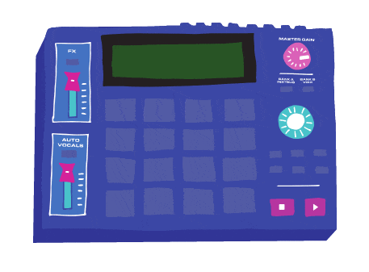

# MAGENTA MACHINE V2

Loop station made with Tone.js.

The design is inspired from the AKAI MPC1000, loaded with Boum Bap audio loops.

## Credits

- [Simon Rubuano](https://github.com/mgkprod)
- Audio loops (c) [MAGENTA](http://www.magentaclub.fr/)
- MPC-1000 artwork (c) [Margot Malgras](https://www.instagram.com/togram.stagram)

## License

Copyright (c) 2020-2021 Simon Rubuano (@mgkprod) and contributors

Licensed under the MIT license, see [LICENSE.md](LICENSE.md) for details.
